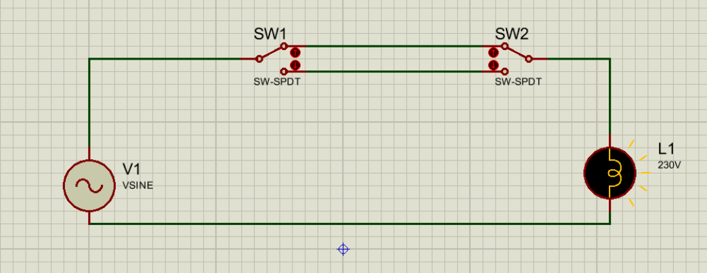
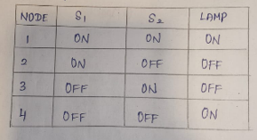
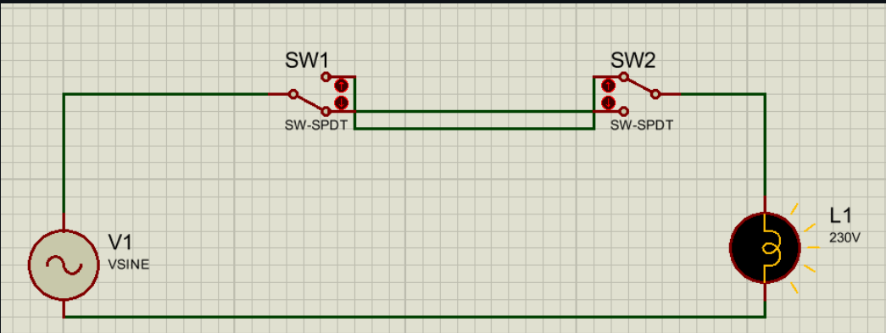
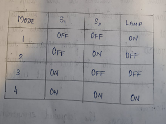

# EXP-3
EXPT NO: 3				STAIR CASE WIRING                     
AIM
 To control the status of the given lamp by using two–way switches. 
APPARATUS REQUIRED:
S. No.Name of the apparatus	Range / Type	Quantity
1	Incandescent Lamp	60W	1 No.
2	Lamp Holder	Pendent Type	1 No.
3	SPDT Switch	230V,5A	2 Nos
4	Wires	1/18”	As per requirement
Theory:
•	A two way switch is installed near the first step of the stairs. The other two way switch is installed at the upper part where the stair ends.
•	The light point is provided between first and last stair at an adequate location and height if the light is switched on by the lower switch. It can be switched off by the switch at the top or vice versa.
•	The circuit can be used at the places like bed room where the person may  not  have  to  travel for switching off the light to the place from where the light switched on.
PROCEDURE
•  Place the accessories on the wiring board as per the circuit diagram.
•  Place the P.V.C pipe and insert two wires into the P.V.C pipe.
•	Take one wire connect one end to the phase side and other end to the middle point of SPDT switch 1
•  Upper point of SPDT switch 1 is connected to the lower point of SPDTswitch2.
•  Lower point of SPDT 1 is connected to the upper point SPDT switch2.
•	Another wire taken through a P.V.C pipe and middle point of SPDT switch 2 is connected to one end of the lamp holder.
Direct connection: CIRCUIT DIAGRAM: 
   
Tabulation:1

Cross connection: CIRCUIT DIAGRAM:     
     
Tabulation:2

RESULT: Thus the staircase wiring is connected and tested.
